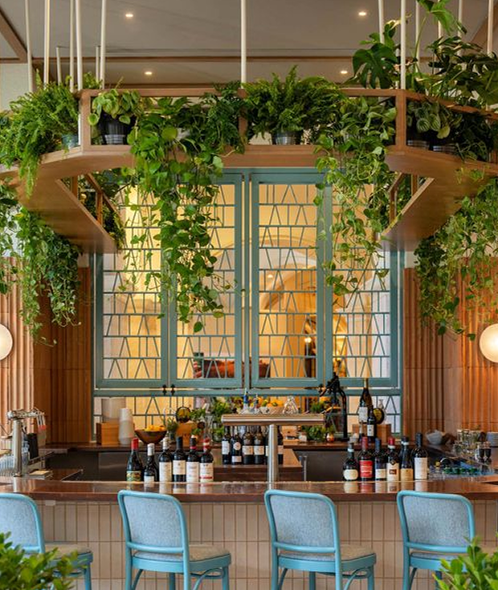
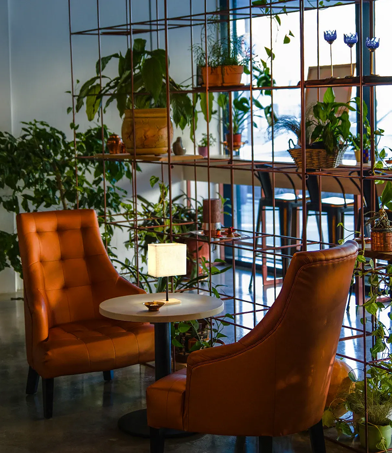
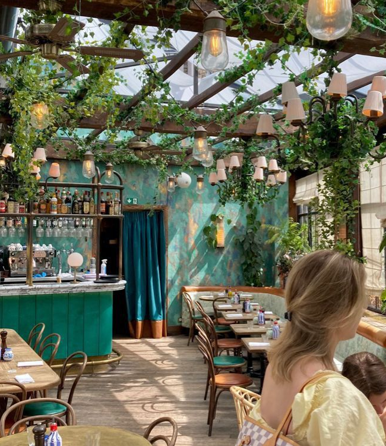
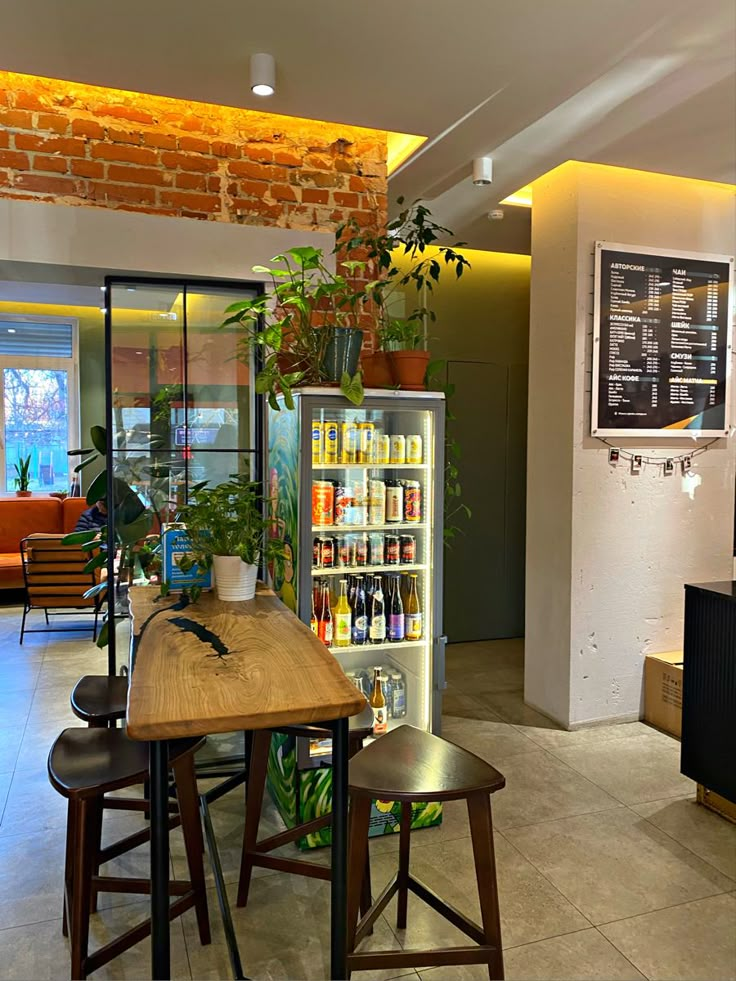
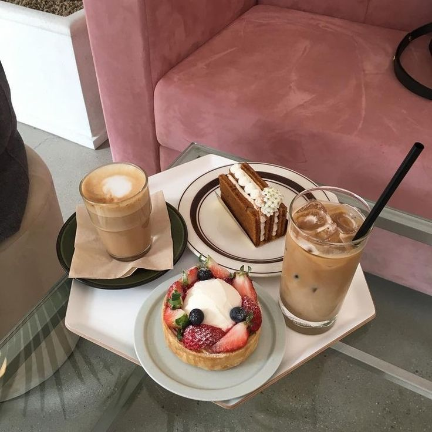

# Документация сайта-визитки кафе Lumine

## Содержание

- [Код для главной страницы](#general)
- [Форма бронирования](#booking)
- [HTML структура формы](#booking-html)
- [CSS стили формы](#booking-css)
- [JavaScript для обработки формы](#booking-js)
- [Передача данных бронирования](#booking-data)
- [Код для отправки данных](#booking-send)
- [Обработка ответа сервера](#booking-response)
- [Уведомление об успешной отправке](#booking-success)
- [HTML структура уведомления](#success-html)
- [CSS стили уведомления](#success-css)
- [JavaScript для отображения уведомления](#success-js)
- [Код для создания раздела «О кафе»](#about)
- [Код для создания раздела «События»](#events)
- [Код для раздела «Меню»](#menu)
- [Код для раздела «Фотогалерея»](#gallery)
- [Код для раздела «Контакты»](#contacts)
- [Код для навигационного элемента «Возврат к началу страницы»](#nav)

<a name="general"><h2>Код для главной страницы</h2></a>

### HTML

```html

<!DOCTYPE html>

<html lang="ru">

<head>

<meta charset="UTF-8">

<meta name="viewport" content="width=device-width, initial-scale=1.0">

<title>Сайт-визитка</title>

<link rel="stylesheet" href="style.css">

<link href="https://fonts.googleapis.com/css2?family=Montserrat+Alternates:wght@400;500;700&display=swap" rel="stylesheet">

</head>

<body>

<header class="header">

<nav class="nav">

<div class="nav__content">

<a href="#home" class="logo">


</a>

<ul class="nav__list">

<li><a href="#about">О кафе</a></li>

<li><a href="#events">События</a></li>

<li><a href="#menu">Меню</a></li>

<li><a href="#gallery">Фотогалерея</a></li>

<li><a href="#contacts">Контакты</a></li>

</ul>

</div>

</nav>

</header>

  

<section class="hero" id="home">

<div class="hero__bg"></div>

<div class="container hero__content">

<h1 class="hero__title">Вкус,<br>который<br>останется<br>в памяти</h1>

<button class="hero__btn">Забронировать столик</button>

</div>

</section>

</body>

</html>

```

### CSS

```css

/* Header and Navigation */

.header {

background: transparent;

box-shadow: none;

position: fixed;

width: 100%;

top: 0;

left: 0;

z-index: 1000;

transition: box-shadow 0.2s;

margin: 0 -20px;

}

  

.nav__content {

display: flex;

justify-content: space-between;

align-items: center;

width: 100%;

}

  

.logo {

display: flex;

align-items: center;

gap: 0.5rem;

}

  

.nav__list {

display: flex;

gap: 2.2rem;

list-style: none;

}

  

.nav__list a {

text-decoration: none;

color: #222;

font-size: 1.08rem;

font-weight: 400;

letter-spacing: 0.01em;

transition: color 0.2s;

}

  

.nav__list a:hover,

.nav__list a.active {

color: #b88c5a;

}

  

/* Hero Section */

.hero {

position: relative;

min-height: 1000px;

width: 100vw;

left: 50%;

right: 50%;

transform: translateX(-50%);

display: flex;

align-items: center;

justify-content: center;

flex-direction: column;

padding-top: 0;

padding-bottom: 0;

overflow: hidden;

text-align: center;

}

  

.hero__bg {

position: absolute;

top: 0; left: 0; right: 0; bottom: 0;

background: url('assets/background.png') center/cover no-repeat;

z-index: 1;

width: 100%;

height: 100%;

filter: brightness(0.85);

}

  

.hero__content {

position: relative;

z-index: 2;

display: flex;

flex-direction: column;

align-items: center;

justify-content: center;

width: 100%;

max-width: none;

margin: 0 auto;

}

  

.hero__title {

font-size: 2.8rem;

font-weight: 400;

color: #222;

line-height: 1.1;

margin-bottom: 2rem;

text-shadow: 0 2px 8px rgba(255,255,255,0.5);

text-align: center;

}

  

.hero__btn {

padding: 1.1rem 2.5rem;

font-size: 1.1rem;

font-family: 'Montserrat Alternates', Arial, sans-serif;

background: transparent;

color: #222;

border: 1.5px solid #222;

border-radius: 4px;

cursor: pointer;

transition: background 0.2s, color 0.2s, box-shadow 0.2s, border-color 0.2s;

box-shadow: 0 2px 8px rgba(0,0,0,0.04);

font-weight: 500;

letter-spacing: 0.01em;

}

  

.hero__btn:hover {

background: #f5f5f5;

color: #000;

border-color: #000;

box-shadow: 0 4px 16px rgba(0,0,0,0.10);

}

```

<a name="booking"><h2>Форма бронирования</h2></a>

### HTML структура формы {#html-структура-формы}

```html

<div class="booking-modal" id="bookingModal">

<div class="booking-modal__content">

<button class="booking-modal__close" id="bookingClose">&times;</button>

<div class="booking-modal__title-line">

<span class="booking-modal__line"></span>

<h2>Забронировать столик</h2>

<span class="booking-modal__line"></span>

</div>

<form class="booking-form" id="bookingForm" autocomplete="off">

<input type="text" name="name" placeholder="Введите имя" class="booking-form__input" required>

<div class="booking-form__error">Обязательное поле</div>

<input type="tel" name="phone" placeholder="Введите номер телефона" class="booking-form__input" required>

<div class="booking-form__error">Обязательное поле</div>

<label class="booking-form__label">Время брони</label>

<select name="time" class="booking-form__select booking-form__input" required></select>

<div class="booking-form__error">Обязательное поле</div>

<label class="booking-form__label">Дата брони</label>

<div class="booking-form__date-wrap">

<input type="text" name="date" class="booking-form__input booking-form__input--date" placeholder="__.__.____" readonly required>

<button type="button" class="booking-form__calendar-btn" id="calendarBtn">


</button>

<div class="booking-form__calendar" id="calendarPopup"></div>

</div>

<div class="booking-form__error">Обязательное поле</div>

<button type="submit" class="booking-form__submit">Отправить</button>

</form>

</div>

</div>

```

### CSS стили формы {#css-стили-формы}

```css

.booking-modal {

position: fixed;

top: 0;

left: 0;

width: 100%;

height: 100%;

background: rgba(0,0,0,0.5);

display: flex;

align-items: center;

justify-content: center;

z-index: 1000;

opacity: 0;

visibility: hidden;

transition: opacity 0.3s, visibility 0.3s;

}

  

.booking-modal.active {

opacity: 1;

visibility: visible;

}

  

.booking-modal__content {

background: #fff;

padding: 2rem;

border-radius: 12px;

width: 90%;

max-width: 500px;

position: relative;

animation: fadeIn 0.3s;

}

  

.booking-form {

display: flex;

flex-direction: column;

gap: 1rem;

margin-top: 1.5rem;

}

  

.booking-form__input {

padding: 0.8rem 1rem;

border: 1px solid #ddd;

border-radius: 4px;

font-size: 1rem;

transition: border-color 0.2s;

}

  

.booking-form__input:focus {

border-color: #b88c5a;

outline: none;

}

  

.booking-form__input--error {

border-color: #ff4444;

}

  

.booking-form__error {

color: #ff4444;

font-size: 0.9rem;

display: none;

}

  

.booking-form__submit {

background: #b88c5a;

color: #fff;

border: none;

padding: 1rem;

border-radius: 4px;

font-size: 1rem;

cursor: pointer;

transition: background 0.2s;

}

  

.booking-form__submit:hover {

background: #a67b4a;

}

```

### JavaScript для обработки формы {#javascript-для-обработки-формы}

```javascript

// Инициализация формы

const bookingForm = document.getElementById('bookingForm');

const bookingModal = document.getElementById('bookingModal');

const bookingClose = document.getElementById('bookingClose');

  

// Открытие/закрытие модального окна

function openBookingModal() {

bookingModal.classList.add('active');

}

  

function closeBookingModal() {

bookingModal.classList.remove('active');

bookingForm.reset();

clearBookingErrors();

}

  

// Очистка ошибок

function clearBookingErrors() {

document.querySelectorAll('.booking-form__input').forEach(input => {

input.classList.remove('booking-form__input--error');

});

document.querySelectorAll('.booking-form__error').forEach(error => {

error.style.display = 'none';

});

}

  

// Обработчики событий

bookingClose.addEventListener('click', closeBookingModal);

document.querySelector('.hero__btn').addEventListener('click', openBookingModal);

```

<a name="booking-data"><h2>Передача данных бронирования</h2></a>

### Код для отправки данных {#код-для-отправки-данных}

```javascript

bookingForm.addEventListener('submit', function(e) {

e.preventDefault();

clearBookingErrors();

// Валидация формы

let valid = true;

const inputs = bookingForm.querySelectorAll('.booking-form__input');

inputs.forEach((inp, idx) => {

if (!inp.value.trim()) {

inp.classList.add('booking-form__input--error');

bookingForm.querySelectorAll('.booking-form__error')[idx].style.display = 'block';

valid = false;

}

});

if (!valid) return;

// Подготовка данных

const formData = new URLSearchParams();

inputs.forEach(inp => {

formData.append(inp.name, inp.value);

});

// Отправка данных

fetch('https://script.google.com/macros/s/AKfycbzRwl9wyCSuGoca9EkPacVzo4JrUka7xM9zWediq_r2Ttmns5lj7KdEFJGUBogqAoEx/exec', {

method: 'POST',

body: formData

})

.then(res => res.json())

.then(handleResponse)

.catch(handleError);

});

```

### Обработка ответа сервера {#обработка-ответа-сервера}

```javascript

function handleResponse(resp) {

if (resp.result === 'success') {

closeBookingModal();

showSuccessMessage();

} else {

showErrorMessage('Ошибка отправки. Попробуйте позже.');

}

}

  

function handleError() {

showErrorMessage('Ошибка отправки. Попробуйте позже.');

}

```

<a name="booking-success"><h2>Уведомление об успешной отправке</h2></a>

### HTML структура уведомления {#html-структура-уведомления}

```html

<div class="success-message" id="successMessage">

<div class="success-message__content">


<h3>Спасибо!</h3>

<p>Ваша заявка успешно отправлена</p>

<button class="success-message__close">Закрыть</button>

</div>

</div>

```

### CSS стили уведомления {#css-стили-уведомления}

```css

.success-message {

position: fixed;

top: 0;

left: 0;

width: 100%;

height: 100%;

background: rgba(0,0,0,0.5);

display: flex;

align-items: center;

justify-content: center;

z-index: 2000;

opacity: 0;

visibility: hidden;

transition: opacity 0.3s, visibility 0.3s;

}

  

.success-message.active {

opacity: 1;

visibility: visible;

}

  

.success-message__content {

background: #fff;

padding: 2rem;

border-radius: 12px;

text-align: center;

transform: translateY(20px);

transition: transform 0.3s;

}

  

.success-message.active .success-message__content {

transform: translateY(0);

}

  

.success-message__icon {

width: 64px;

height: 64px;

margin-bottom: 1rem;

}

  

.success-message h3 {

font-size: 1.5rem;

margin-bottom: 0.5rem;

color: #222;

}

  

.success-message p {

color: #666;

margin-bottom: 1.5rem;

}

  

.success-message__close {

background: #b88c5a;

color: #fff;

border: none;

padding: 0.8rem 2rem;

border-radius: 4px;

cursor: pointer;

transition: background 0.2s;

}

  

.success-message__close:hover {

background: #a67b4a;

}

```

### JavaScript для отображения уведомления {#javascript-для-отображения-уведомления}

```javascript

function showSuccessMessage() {

const successMessage = document.getElementById('successMessage');

successMessage.classList.add('active');

// Закрытие уведомления

successMessage.querySelector('.success-message__close').addEventListener('click', () => {

successMessage.classList.remove('active');

});

}

  

function showErrorMessage(message) {

alert(message);

}

```

<a name="about"><h2>Код для создания раздела «О кафе»</h2></a>

### HTML

```html

<section id="about" class="about">

<div class="container about__container">

<div class="about__text">

<div class="about__title-line">

<span class="about__line"></span>

<h2>Кафе Lumine</h2>

<span class="about__line"></span>

</div>

<p>Мы – уютное кафе, где каждый найдёт уголок для себя. Мы стараемся создать место, где вы можете расслабиться, провести время с близкими или просто насладиться чашечкой кофе и вкусным десертом.</p>

<p>Наш персонал это молодые энергичные люди они встречают гостей улыбками и хорошим настроением вдохновляют посетителей и заряжают их бодрости на весь последующий день</p>

</div>

<div class="about__carousel">

<div class="carousel__wrapper">







<button class="carousel__arrow carousel__arrow--left">&#8592;</button>

<button class="carousel__arrow carousel__arrow--right">&#8594;</button>

</div>

<div class="carousel__dots">

<span class="carousel__dot active"></span>

<span class="carousel__dot"></span>

<span class="carousel__dot"></span>

</div>

</div>

</div>

</section>

```

### CSS

```css

.about {

padding: 80px 0 60px 0;

}

  

.about__container {

display: flex;

gap: 48px;

align-items: center;

justify-content: space-between;

}

  

.about__text {

flex: 1 1 340px;

max-width: 480px;

}

  

.about__text h2 {

font-size: 2rem;

margin-bottom: 1.5rem;

font-weight: 700;

}

  

.about__text p {

font-size: 1.1rem;

margin-bottom: 1.1rem;

color: #444;

}

  

.about__carousel {

flex: 1 1 340px;

max-width: 620px;

position: relative;

display: flex;

flex-direction: column;

align-items: center;

}

  

.carousel__wrapper {

position: relative;

width: 620px;

height: 734px;

overflow: hidden;

border-radius: 0;

box-shadow: none;

background: #f7f7f7;

margin-bottom: 18px;

border: 1px solid #e0e0e0;

}

  

.carousel__image {

position: absolute;

top: 0; left: 0;

width: 100%;

height: 100%;

object-fit: cover;

opacity: 0;

transition: opacity 0.5s;

z-index: 1;

}

  

.carousel__image.active {

opacity: 1;

z-index: 2;

}

```

<a name="events"><h2>Код для создания раздела «События»</h2></a>

### HTML структура событий

```html

<section id="events" class="events">

<div class="container">

<div class="events__title-line">

<span class="events__line"></span>

<h2>События</h2>

<span class="events__line"></span>

</div>

<div class="events__carousel">

<button class="events__arrow events__arrow--left">&#60;</button>

<div class="events__cards">

<div class="event-card" data-event="1">


<div class="event-card__title">Живая музыка</div>

<div class="event-card__desc">Только по пятницам и субботам</div>

</div>

<div class="event-card" data-event="2">


<div class="event-card__title">Семейный выходной</div>

<div class="event-card__desc">Каждое воскресенье</div>

</div>

</div>

<button class="events__arrow events__arrow--right">&#62;</button>

</div>

</div>

</section>

  

<!-- Модальное окно для подробностей события -->

<div class="event-modal" id="eventModal">

<div class="event-modal__content">

<div class="event-modal__miniheader">

<button class="event-modal__back">&#60;</button>

<span class="event-modal__minititle">События</span>

</div>

<div class="event-modal__divider"></div>


<div class="event-modal__info">

<h3 class="event-modal__title"></h3>

<div class="event-modal__date"></div>

<div class="event-modal__desc"></div>

<div class="event-modal__details"></div>

</div>

</div>

</div>

```

### CSS стили для событий и модального окна

```css

/* Стили для карточек событий */

.event-card {

flex: 0 0 calc(33.333% - 1rem);

background: #fff;

border-radius: 8px;

overflow: hidden;

box-shadow: 0 2px 8px rgba(0,0,0,0.1);

transition: transform 0.2s;

cursor: pointer;

}

  

.event-card:hover {

transform: translateY(-5px);

}

  

.event-card img {

width: 100%;

height: 200px;

object-fit: cover;

}

  

.event-card__title {

font-size: 1.2rem;

font-weight: 600;

padding: 1rem;

color: #222;

}

  

.event-card__desc {

padding: 0 1rem 1rem;

color: #666;

}

  

/* Стили для модального окна события */

.event-modal {

position: fixed;

top: 0;

left: 0;

width: 100%;

height: 100%;

background: rgba(0,0,0,0.5);

display: flex;

align-items: center;

justify-content: center;

z-index: 1000;

opacity: 0;

visibility: hidden;

transition: opacity 0.3s, visibility 0.3s;

}

  

.event-modal.active {

opacity: 1;

visibility: visible;

}

  

.event-modal__content {

background: #fff;

width: 90%;

max-width: 800px;

border-radius: 12px;

overflow: hidden;

position: relative;

}

  

.event-modal__miniheader {

display: flex;

align-items: center;

padding: 1rem;

background: #f5f5f5;

}

  

.event-modal__back {

background: none;

border: none;

font-size: 1.5rem;

cursor: pointer;

color: #666;

padding: 0.5rem;

margin-right: 1rem;

}

  

.event-modal__minititle {

font-size: 1.1rem;

color: #222;

}

  

.event-modal__divider {

height: 1px;

background: #ddd;

}

  

.event-modal__img {

width: 100%;

height: 400px;

object-fit: cover;

}

  

.event-modal__info {

padding: 2rem;

}

  

.event-modal__title {

font-size: 1.8rem;

font-weight: 600;

margin-bottom: 1rem;

color: #222;

}

  

.event-modal__date {

font-size: 1.1rem;

color: #b88c5a;

margin-bottom: 1rem;

}

  

.event-modal__desc {

font-size: 1.1rem;

color: #444;

margin-bottom: 1.5rem;

line-height: 1.6;

}

  

.event-modal__details {

font-size: 1rem;

color: #666;

line-height: 1.6;

}

  

.event-modal__details ul {

list-style: none;

padding: 0;

}

  

.event-modal__details li {

margin-bottom: 0.5rem;

padding-left: 1.5rem;

position: relative;

}

  

.event-modal__details li:before {

content: "•";

color: #b88c5a;

position: absolute;

left: 0;

}

```

### JavaScript для обработки событий и отображения деталей

```javascript

// Данные о событиях

const eventData = {

1: {

title: "Живая музыка",

date: "Каждую пятницу и субботу",

description: "Насладитесь живой музыкой в уютной атмосфере нашего кафе",

details: `

<ul>

<li>Выступление профессиональных музыкантов</li>

<li>Разнообразный репертуар</li>

<li>Особая атмосфера вечера</li>

<li>Возможность заказать любимую песню</li>

</ul>

`,

image: "assets/Events/Живая музыка.jpg"

},

2: {

title: "Семейный выходной",

date: "Каждое воскресенье",

description: "Специальное предложение для всей семьи",

details: `

<ul>

<li>Детская игровая зона с аниматорами</li>

<li>Специальное детское меню</li>

<li>Мастер-классы для детей</li>

<li>Скидка 20% на семейные наборы</li>

<li>Бесплатный десерт для детей до 12 лет</li>

<li>Развлекательная программа</li>

</ul>

`,

image: "assets/Events/Семейный выходной.jpg"

}

};

  

// Обработчики для карточек событий

document.querySelectorAll('.event-card').forEach(card => {

card.addEventListener('click', () => {

const eventId = card.dataset.event;

const event = eventData[eventId];

if (event) {

const modal = document.getElementById('eventModal');

modal.querySelector('.event-modal__img').src = event.image;

modal.querySelector('.event-modal__title').textContent = event.title;

modal.querySelector('.event-modal__date').textContent = event.date;

modal.querySelector('.event-modal__desc').textContent = event.description;

modal.querySelector('.event-modal__details').innerHTML = event.details;

modal.classList.add('active');

}

});

});

  

// Закрытие модального окна

document.querySelector('.event-modal__back').addEventListener('click', () => {

document.getElementById('eventModal').classList.remove('active');

});

  

// Закрытие по клику вне модального окна

document.getElementById('eventModal').addEventListener('click', (e) => {

if (e.target === e.currentTarget) {

e.currentTarget.classList.remove('active');

}

});

  

// Закрытие по нажатию Escape

document.addEventListener('keydown', (e) => {

if (e.key === 'Escape') {

document.getElementById('eventModal').classList.remove('active');

}

});

```

<a name="menu"><h2>Код для раздела «Меню»</h2></a>

### HTML структура меню

```html

<section id="menu" class="menu">

<div class="container">

<div class="menu__title-line">

<span class="menu__line"></span>

<h2>Меню</h2>

<span class="menu__line"></span>

</div>

<!-- Кнопки категорий -->

<div class="menu__categories">

<button class="menu__category active" data-category="all">Все</button>

<button class="menu__category" data-category="hot">Горячие блюда</button>

<button class="menu__category" data-category="cold">Холодные закуски</button>

<button class="menu__category" data-category="desserts">Десерты</button>

<button class="menu__category" data-category="drinks">Напитки</button>

<button class="menu__category" data-category="new">Новинки</button>

</div>

  

<!-- Выпадающий список для мобильных устройств -->

<div class="menu__dropdown">

<select id="menuSelect">

<option value="all">Все</option>

<option value="hot">Горячие блюда</option>

<option value="cold">Холодные закуски</option>

<option value="desserts">Десерты</option>

<option value="drinks">Напитки</option>

<option value="new">Новинки</option>

</select>

</div>

  

<!-- Сетка блюд -->

<div class="menu__grid">

<!-- Новинки -->

<div class="menu-item" data-category="new">

<div class="menu-item__image">


<div class="menu-item__new-badge">Новинка</div>

</div>

<div class="menu-item__info">

<h3 class="menu-item__title">Трюфельная паста</h3>

<p class="menu-item__desc">Паста с трюфельным соусом и пармезаном</p>

<div class="menu-item__price">650 ₽</div>

</div>

</div>

  

<div class="menu-item" data-category="new">

<div class="menu-item__image">


<div class="menu-item__new-badge">Новинка</div>

</div>

<div class="menu-item__info">

<h3 class="menu-item__title">Морской коктейль</h3>

<p class="menu-item__desc">Микс из морепродуктов в сливочном соусе</p>

<div class="menu-item__price">890 ₽</div>

</div>

</div>

  

<div class="menu-item" data-category="new">

<div class="menu-item__image">


<div class="menu-item__new-badge">Новинка</div>

</div>

<div class="menu-item__info">

<h3 class="menu-item__title">Ягодный чизкейк</h3>

<p class="menu-item__desc">Классический чизкейк с ягодным соусом</p>

<div class="menu-item__price">450 ₽</div>

</div>

</div>

</div>

</div>

</section>

```

### CSS стили для меню и новинок

```css

/* Стили для раздела меню */

.menu {

padding: 80px 0;

background: #f9f9f9;

}

  

.menu__title-line {

display: flex;

align-items: center;

justify-content: center;

gap: 1rem;

margin-bottom: 2rem;

}

  

.menu__title-line h2 {

font-size: 2rem;

font-weight: 700;

color: #222;

}

  

.menu__line {

flex: 1;

height: 1px;

background: #ddd;

max-width: 100px;

}

  

/* Стили для категорий */

.menu__categories {

display: flex;

justify-content: center;

gap: 1rem;

margin-bottom: 2rem;

flex-wrap: wrap;

}

  

.menu__category {

padding: 0.8rem 1.5rem;

border: 2px solid #b88c5a;

border-radius: 25px;

background: transparent;

color: #b88c5a;

font-size: 1rem;

cursor: pointer;

transition: all 0.3s;

}

  

.menu__category:hover,

.menu__category.active {

background: #b88c5a;

color: #fff;

}

  

/* Стили для выпадающего списка */

.menu__dropdown {

display: none;

margin-bottom: 2rem;

}

  

.menu__dropdown select {

width: 100%;

padding: 0.8rem;

border: 2px solid #b88c5a;

border-radius: 8px;

font-size: 1rem;

color: #b88c5a;

background: #fff;

cursor: pointer;

}

  

/* Стили для сетки блюд */

.menu__grid {

display: grid;

grid-template-columns: repeat(auto-fill, minmax(300px, 1fr));

gap: 2rem;

padding: 1rem;

}

  

/* Стили для карточек блюд */

.menu-item {

background: #fff;

border-radius: 12px;

overflow: hidden;

box-shadow: 0 2px 8px rgba(0,0,0,0.1);

transition: transform 0.3s;

}

  

.menu-item:hover {

transform: translateY(-5px);

}

  

.menu-item__image {

position: relative;

height: 200px;

}

  

.menu-item__image img {

width: 100%;

height: 100%;

object-fit: cover;

}

  

/* Стили для бейджа "Новинка" */

.menu-item__new-badge {

position: absolute;

top: 1rem;

right: 1rem;

background: #b88c5a;

color: #fff;

padding: 0.5rem 1rem;

border-radius: 20px;

font-size: 0.9rem;

font-weight: 600;

box-shadow: 0 2px 4px rgba(0,0,0,0.2);

}

  

.menu-item__info {

padding: 1.5rem;

}

  

.menu-item__title {

font-size: 1.3rem;

font-weight: 600;

color: #222;

margin-bottom: 0.5rem;

}

  

.menu-item__desc {

font-size: 1rem;

color: #666;

margin-bottom: 1rem;

line-height: 1.4;

}

  

.menu-item__price {

font-size: 1.2rem;

font-weight: 600;

color: #b88c5a;

}

  

/* Медиа-запросы для адаптивности */

@media (max-width: 768px) {

.menu__categories {

display: none;

}

.menu__dropdown {

display: block;

}

.menu__grid {

grid-template-columns: repeat(auto-fill, minmax(250px, 1fr));

}

}

```

### JavaScript для фильтрации меню

```javascript

// Обработка фильтрации меню

document.addEventListener('DOMContentLoaded', () => {

const menuItems = document.querySelectorAll('.menu-item');

const categoryButtons = document.querySelectorAll('.menu__category');

const menuSelect = document.getElementById('menuSelect');

  

// Функция фильтрации

function filterMenu(category) {

menuItems.forEach(item => {

if (category === 'all' || item.dataset.category === category) {

item.style.display = 'block';

} else {

item.style.display = 'none';

}

});

  

// Обновление активной кнопки

categoryButtons.forEach(button => {

if (button.dataset.category === category) {

button.classList.add('active');

} else {

button.classList.remove('active');

}

});

  

// Обновление выпадающего списка

menuSelect.value = category;

}

  

// Обработчики для кнопок категорий

categoryButtons.forEach(button => {

button.addEventListener('click', () => {

filterMenu(button.dataset.category);

});

});

  

// Обработчик для выпадающего списка

menuSelect.addEventListener('change', () => {

filterMenu(menuSelect.value);

});

  

// Анимация появления новинок

const newItems = document.querySelectorAll('.menu-item[data-category="new"]');

newItems.forEach((item, index) => {

item.style.opacity = '0';

item.style.transform = 'translateY(20px)';

setTimeout(() => {

item.style.transition = 'opacity 0.5s ease, transform 0.5s ease';

item.style.opacity = '1';

item.style.transform = 'translateY(0)';

}, index * 200);

});

});

```

<a name="gallery"><h2>Код для раздела «Фотогалерея»</h2></a>

### HTML

```html

<section id="gallery" class="gallery">

<div class="container">

<div class="gallery__title-line">

<span class="gallery__line"></span>

<h2>Фотогалерея</h2>

<span class="gallery__line"></span>

</div>

<div class="gallery__grid gallery__grid--fixed">








</div>

</div>

</section>

```

### CSS

```css

.gallery {

padding: 80px 0;

}

  

.gallery__title-line {

display: flex;

align-items: center;

justify-content: center;

gap: 1rem;

margin-bottom: 2rem;

}

  

.gallery__title-line h2 {

font-size: 2rem;

font-weight: 700;

color: #222;

}

  

.gallery__line {

flex: 1;

height: 1px;

background: #ddd;

max-width: 100px;

}

  

.gallery__grid--fixed {

display: grid;

grid-template-columns: repeat(4, 1fr);

grid-template-rows: repeat(2, 300px);

gap: 1rem;

}

  

.gallery__img {

width: 100%;

height: 100%;

object-fit: cover;

border-radius: 8px;

transition: transform 0.2s;

}

  

.gallery__img:hover {

transform: scale(1.02);

}

```

<a name="contacts"><h2>Код для раздела «Контакты»</h2></a>

### HTML

```html

<section id="contacts" class="contacts">

<div class="container">

<div class="contacts__title-line">

<span class="contacts__line"></span>

<h2>Контакты</h2>

<span class="contacts__line"></span>

</div>

<div class="contacts__grid">

<div class="contacts__item">


<div class="contacts__label">Адрес</div>

<div class="contacts__text">Самара<br>улица Фрунзе 97</div>

</div>

<div class="contacts__divider"></div>

<div class="contacts__item">


<div class="contacts__label">Телефон</div>

<div class="contacts__text contacts__text--phone">+7 (393) 010-12-21</div>

<div class="contacts__links">

<a href="mailto:anastasiamoiseeva506@gmail.com" class="contacts__link">anastasiamoiseeva506@gmail.com</a><br>

<a href="https://t.me/bananapap0y" class="contacts__link" target="_blank">@bananapap0y</a>

</div>

</div>

<div class="contacts__divider"></div>

<div class="contacts__item">


<div class="contacts__label">Режим работы</div>

<div class="contacts__text">

Пн-Чт — 10:00 - 22:00<br>

Пт - Сб — 10:00 - 23:00<br>

Вс — 10:00 - 22:00

</div>

</div>

</div>

<div class="contacts__map-placeholder">

<iframe src="https://yandex.ru/map-widget/v1/?ll=50.091983%2C53.187872&z=16&l=map&pt=50.091983,53.187872,pm2rdm" width="100%" height="350" frameborder="0" allowfullscreen style="border-radius:12px;"></iframe>

</div>

</div>

</section>

```

### CSS

```css

.contacts {

padding: 80px 0;

}

  

.contacts__title-line {

display: flex;

align-items: center;

justify-content: center;

gap: 1rem;

margin-bottom: 2rem;

}

  

.contacts__title-line h2 {

font-size: 2rem;

font-weight: 700;

color: #222;

}

  

.contacts__line {

flex: 1;

height: 1px;

background: #ddd;

max-width: 100px;

}

  

.contacts__grid {

display: grid;

grid-template-columns: repeat(3, 1fr);

gap: 2rem;

margin-bottom: 2rem;

}

  

.contacts__item {

text-align: center;

padding: 2rem;

}

  

.contacts__icon {

width: 48px;

height: 48px;

margin-bottom: 1rem;

}

  

.contacts__label {

font-size: 1.2rem;

font-weight: 600;

margin-bottom: 0.5rem;

}

  

.contacts__text {

color: #666;

line-height: 1.6;

}

  

.contacts__map-placeholder {

width: 100%;

height: 350px;

border-radius: 12px;

overflow: hidden;

}

```

<a name="nav"><h2>Код для навигационного элемента «Возврат к началу страницы»</h2></a>

### JavaScript

```javascript

document.querySelectorAll('a[href^="#"]').forEach(anchor => {

anchor.addEventListener('click', function (e) {

e.preventDefault();

const target = document.querySelector(this.getAttribute('href'));

if (target) {

target.scrollIntoView({

behavior: 'smooth'

});

}

});

});

```

### CSS

```css

.nav__list a {

text-decoration: none;

color: #222;

font-size: 1.08rem;

font-weight: 400;

letter-spacing: 0.01em;

transition: color 0.2s;

}

  

.nav__list a:hover,

.nav__list a.active {

color: #b88c5a;

}

```
